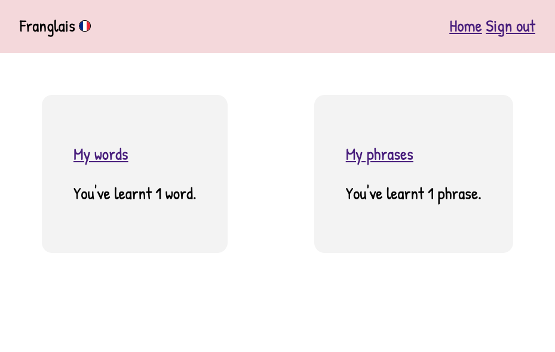
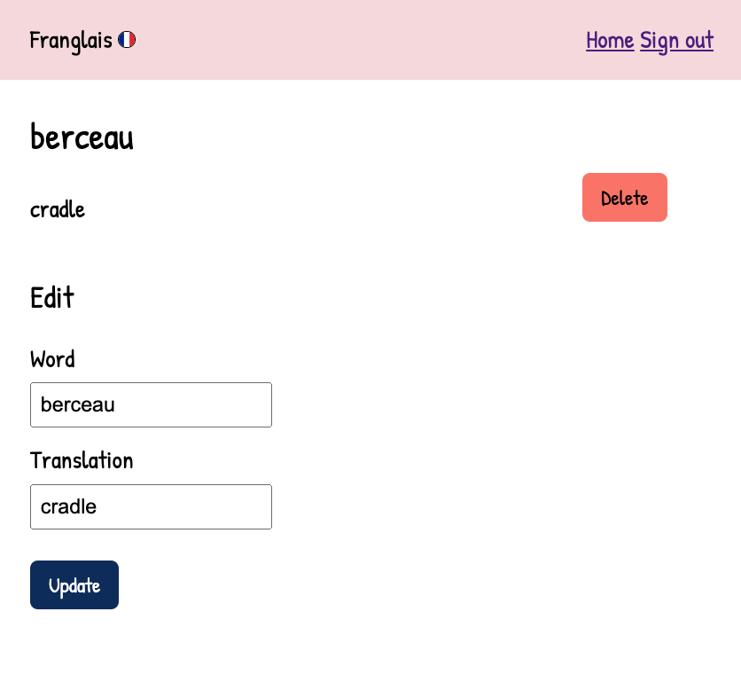
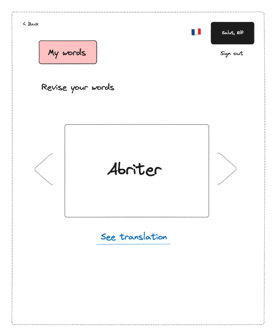

# Franglais

## Background

Use [Franglais](https://unrivaled-panda-92bf9a.netlify.app/start-language-learning "Franglais") to build your own French dictionary. 

With this account-based app you can:

* record words and phrases
* refer back to them
* revise them
* see how many you've learnt
* edit and delete words

When I was studying French at university, I often came across words and phrases while I was out and wanted somewhere to record them. For example, I would see some unfamiliar vocab in a French book while I was travelling, and wanted to remember it.

I found the notes app on my phone didn't inspire me to refer back to my notes. There weren't many options for organising my language notes. 

There are lots of opportunities to expand on this MVP. I conceived this as an app for any language, but given the short timeframe to build the project I have focussed on just one language.

To expand on this, I'd like to give the option to select multiple languages, so that you can have multiple dictionaries accessible from a landing page.

## Screenshots

Screenshot showing the start page.

Screenshot showing the home page with no words and phrases.

Screenshot showing the home page with no words and phrases.

Screenshot showing the home page multiple words and phrases.

Screenshot showing the phrases list.

Screenshot showing the words list.

Screenshot showing how you can delete or edit an entry.

## Planning materials 

Screenshot showing how I designed the app. 

## Technologies used

I used the follow technologies:

* ejs
* html 
* javascript
* css
* Mongo Atlas
* Mongoose
* Express
* bcrypt
* node.js

## Future enhancements

1. Create a revision view so that you can see words and phrases on revision cards on a carousel:

Screenshot showing a revision card view.

2. Cater for multiple languages:

Screenshot showing how the app could cater for multiple languages.

3. Do more with data and inputs, for example:

* allow you to link associated words and phrases
* allow you to specify the type of entry e.g. noun, verb
* create a field for adding prepositions e.g. 'le' or 'la'

4. Improve the design and UX, for example:

* catering for different screen sizes such as mobile - this app is conceived to be used on the go
* improve or completely change the branding depending on the scope of the design
* ask the user whether they're entering a word or phrase, rather than forcing them down 2 seperate paths 

I also need to tidy up the code, for example:

* refactoring it to include controllers to break up the server.js file 
* being smarter with css rules 
* use fewer templates - for example, rather than have a seperate set of templates for words and phrases, I could use half the number of templates but include conditional logic depending on whether the user is adding a phrase or a word 
