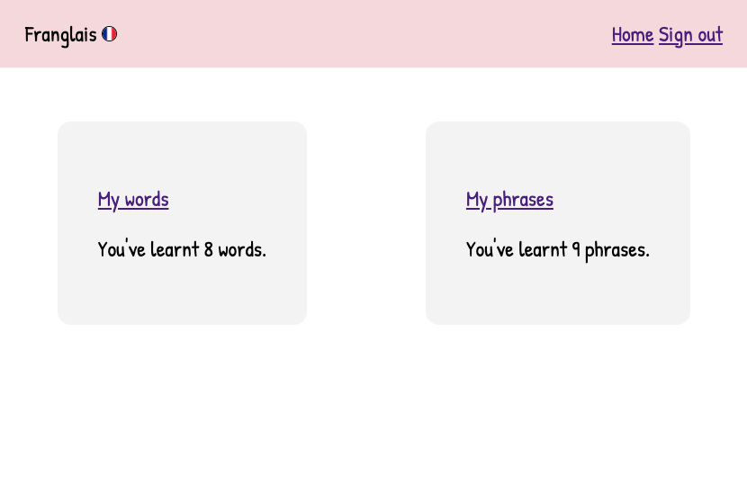

# Franglais

## Background

Use [Franglais](https://unrivaled-panda-92bf9a.netlify.app/start-language-learning "Franglais") to build your own French dictionary. 

You can:

* record words and phrases
* refer back to them
* revise them
* see how many you've learnt

When I was studying French at university, I often came across words and phrases while I was out and wanted somewhere to record them. For example, I would see some unfamiliar vocab in a French book while I was travelling, and wanted to remember it.

I found the notes app on my phone didn't inspire me to refer back to my notes. There weren't many options for organising my language notes. 

There are lots of opportunities to expand on this MVP. I conceieved this as an app for any language, but given the short timeframe to build the project I have focussed on just one language.

To expand this, I'd like give the option to select mutiple languages, so that you can have multiple dictionaries accessible from a landing page. 

## Screenshots

Screenshot showing the start page.

Screenshot showing the home page with words and phrases added.

Screenshot showing the home page with no words and phrases.

Screenshot showing the phrases list.

Screenshot showing the words list.

## Planning materials 

Screenshot showing how I designed the app. 

## Technologies used

I used the follow technologies:

* ejs
* html 
* javscript
* css
* Mongo Atlas
* Mongoose
* Express
* bcrypt
* node.js

## Future enhancements

I would like to:

* create a revision view so that you can see words and phrases on revision cards on a carousel 
* allow you to link associated words and phrases
* allow you to specifiy the type of entry e.g. noun, verb
* create a field for adding prepositions e.g. 'le' or 'la'
* cater for multiple languages 
* refactor the code to include controllers to break up the server js file 
* immprove visual design and cater for different screen sizes, especially for mobile as this app is conceived to be used on the go

